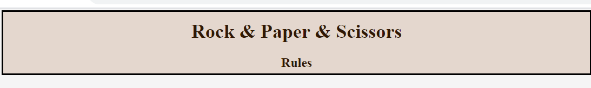
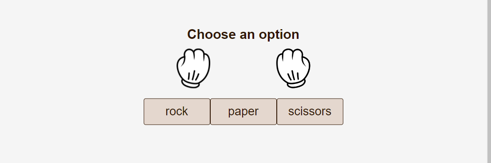
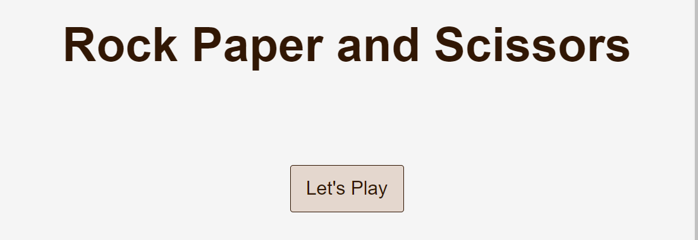
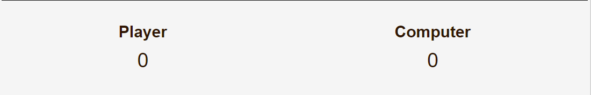
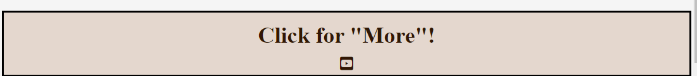
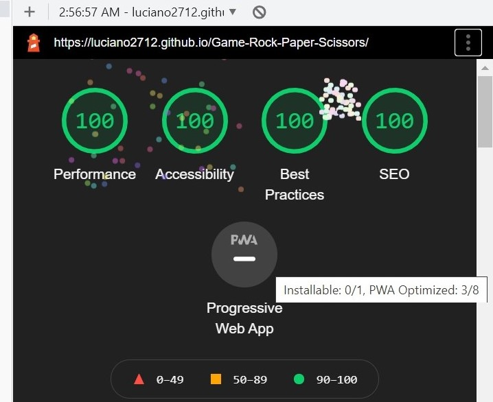

# Rock & Paper & Scissors

Playing Rock Paper Scissors can be as simple as scissors cuts paper, paper covers rock, and rocks crushes scissors, but there is so much more to the game. It is also commonly abbreviated as RPS and is a common and well-known game that is played by everyone all around the World no matter their gender, age, athletic ability or other qualities, everyone has a chance to Win! It is used to settle disputes between two or more individuals with contradicted views and resolve such issues as who gets the last slice of pizza or who will wash the dishes tonight.

For example, Rock & Paper & Scissors is a website where you can join for free and have fun playing for as long as you wish. That is our goal, put you in contact with the game, playing against the machine and get all the practice and experience that you can possibly imagine and become invencible at the game. So, are you up to the challenge!?

## Features

### Existing Features

- __The Rock&Paper&Scissors Heading and Nav__

  - Featured at the top of the page, the heading is easy to see for the user. Upon viewing the page, the user will be able to see the name of the game and click "Rules" to navigate to another page to see the rules.

- __The Match Area__

  - This section will allow the user to play the game. The user will be able to easily see icons for rock, paper or scissors.
  - The user will be able to select one element to play against the computer by clicking on the different icons.

- __The Intro section__

  - The intro section is where the user will be able to see the name of the game as a first contact, and will be asked to play start, so the match area will fade In and the game can start.

- __The Score Area__

  - This section will allow the user to see exactly how many points the player and the computer scored.

- __The Footer Area__

  - This section will allow the user to click an Youtube link that goes to a video with more tips and hints about the game in general.

- __The Rules Area__

  - This section will allow the user to check the rules about the game in general.

### Features Left to Implement

- I would like to have included music to the game.

## Testing

Manual tests were conducted throughout the creation of this site.
Responsivenes was tested and the game runs in different screen sizes.
I have also tested the website using

- HTML Validator
- CSS Validator
- Jshint Validator
- Tested with Chrome DevTools

### Validator Testing

- HTML
  - No errors were returned when passing through the official [W3C validator](https://validator.w3.org/nu/?doc=https%3A%2F%2Fluciano2712.github.io%2FGame-Rock-Paper-Scissors%2F)
- CSS
  - No errors were found when passing through the official [(Jigsaw) validator](https://jigsaw.w3.org/css-validator/validator?uri=https%3A%2F%2Fluciano2712.github.io%2FGame-Rock-Paper-Scissors%2F&profile=css3svg&usermedium=all&warning=1&vextwarning=&lang=pt-BR)
- JavaScript
  - No errors were found when passing through the official [Jshint validator](https://jshint.com/)
    - The following metrics were returned:
      - There are 12 functions in this file.
      - Function with the largest signature take 2 arguments, while the median is 0.
      - Largest function has 34 statements in it, while the median is 3.5.
      - The most complex function has a cyclomatic complexity value of 8 while the median is 1.

### Unfixed Bugs

In the file rules.html, there is a -Block of code- copied from (World Rock Paper Scissors Association (WRPSA)), when this block of code is tested in the HTML validator it shows errors due to the fact of having style in it. I choose not to fix it because the time is really short for this project submission and that part of code is from external source. After talking with my mentor about it, we decided that mentioning it here would be the best to do in due circunstances. It goes from line 28 to line 116.

## Deployment

Deployment To GitHub Pages:

- I logged into [GitHub](https://github.com/)
- In my account on the GitHub website, I selected Repositories
- I selected the Luciano2712/Game-Rock-Paper-Scissors from the GitHub Dashboard.
- I navigated to Settings and to the GitHub Pages section.
- From the Source section, I clicked on the drop-down menu and selected Master Branch.
- Once Master Branch is selected, the page has been automatically refreshed, with a detailed ribbon display GitHub Source Saved Pages indicating the successful implementation.

The live link can be found here - <https://luciano2712.github.io/Game-Rock-Paper-Scissors/>

## Credits

- To create this website, I relied heavily on the material covered in the Full Stack Development course by Code Institute. I also used W3Schools Online Web Tutorials. I learnt the course material but did have to refer to additional YouTube videos to get a better understanding.

### Content

- The text for the Rules.html page was taken from World Rock Paper Scissors Association Website.
- Images for the README are screenshots of the deployed project.
- PNG.images downloaded from [Free PNG](<https://www.vhv.rs/>)
- The icons in the footer were taken from [Font Awesome](https://fontawesome.com/)

### Media

- All images were sourced from other sites using google images and [Free PNG](<https://www.vhv.rs/>).
- Link to Youtube video can be loaded.
- The icons used for the footer were taken from [Font Awesome](https://fontawesome.com/icons?d=gallery)
- Images loaded in the block of external code are from (<https://wrpsa.com/>)
